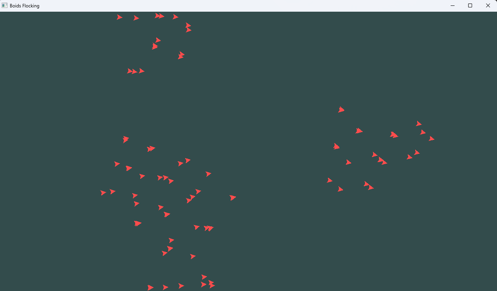

# BoidSim: Autonomous Flocking

 

**BoidSim** is a real-time simulation of bird-like group behavior (Boids), based on Craig Reynolds' fundamental rules and extended with 
modern research into autonomy. This project is developed in parallel with the [`Douter Graphics`](https://github.com/WoutervanDixhoorn/Douter-Graphics/tree/master) framework 
to act as both a testbed and a primary use case for the framework.



## The Simulation
The core logic follows the paper *"Autonomous Boids"* by Hartman and Beneš. In addition to the three classic steering vectors, we implement:

* **Separation**: The tendency to avoid collisions with local flockmates.
* **Cohesion**: The tendency to move toward the center of the local flock.
* **Alignment**: The tendency to match the direction and speed of neighbors.

## Goals
1. [x] Setup architecture with a `BoidManager` and decoupled classes.
2. [x] Implement classic Reynolds steers ($O(n^2)$ baseline).
3. [ ] Integrate the *Change of Leadership* logic from the source paper.
4. [ ] Optimize visibility checks (spatial partitioning) to support hundreds of boids.
5. [ ] Runtime parameter tuning (S, K, M factors) via a GUI.

## Getting Started

### Prerequisites
* CMake (version 3.26+)
* Visual Studio 2022 (with C++23 support)

### Usage
1. Clone the repository.
2. Create your own CMakeUserPresets.json. Paste the following template and update the paths to match your local Emscripten installation:
```json
{
  "version": 3,
  "configurePresets": [
    {
      "name": "wasm-debug",
      "displayName": "WebAssembly Debug",
      "description": "Local Emscripten setup",
      "inherits": "wasm-base",
      "cacheVariables": {
        "CMAKE_BUILD_TYPE": "Debug",
        "CMAKE_TOOLCHAIN_FILE": "C:/PATH_TO_EMSDK/emsdk/upstream/emscripten/cmake/Modules/Platform/Emscripten.cmake",
        "CMAKE_C_COMPILER": "C:/PATH_TO_EMSDK/emsdk/upstream/emscripten/emcc.bat",
        "CMAKE_CXX_COMPILER": "C:/PATH_TO_EMSDK/emsdk/upstream/emscripten/em++.bat",
        "CMAKE_CXX_FLAGS": "-std=c++23",
        "CMAKE_C_FLAGS": "-std=c23"
      }
    }
  ]
}
```
3. Open the folder in Visual Studio (native CMake support).
4. Build the `boid-sim` target. Assets are automatically copied to the output folder via a custom build step.

## References
* **Hartman & Beneš (2006)**: *Autonomous Boids* - Primary source for the leadership implementation.
* **Craig Reynolds**: The pioneer behind the original boids model (1987).